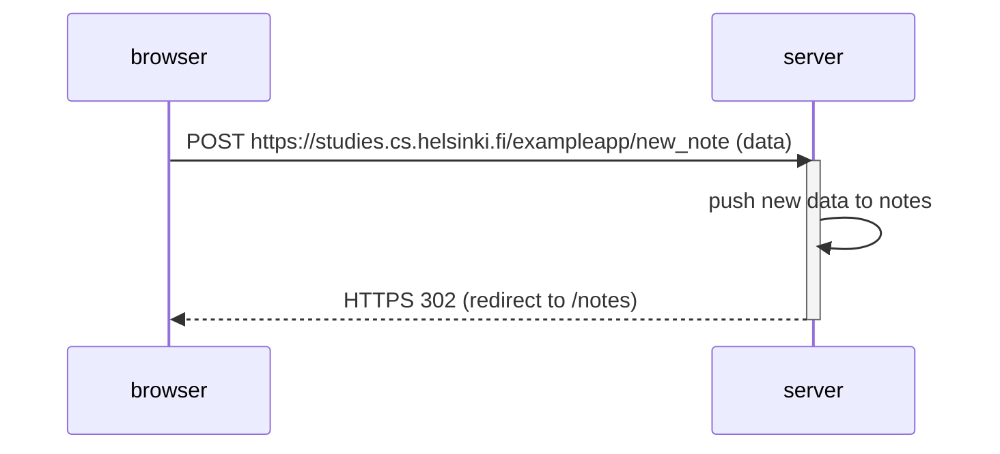

```mermaid
sequenceDiagram
    participant browser
    participant server

    browser->>server: POST https://studies.cs.helsinki.fi/exampleapp/new_note (data)
    activate server
    server->>server: push new data to notes
    server-->>browser: HTTPS 302 (redirect to /notes)
    deactivate server
```